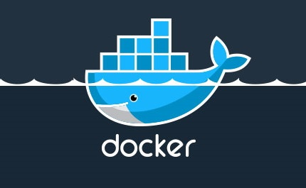
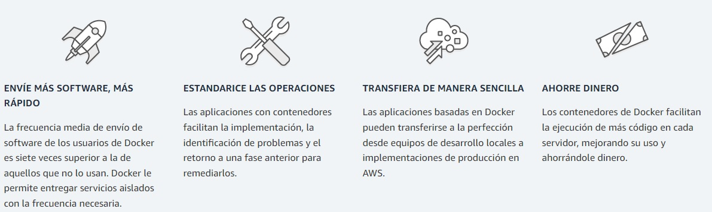
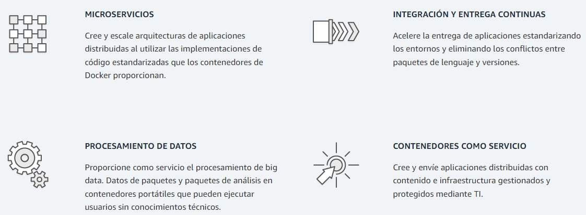
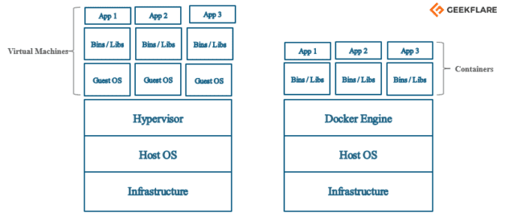
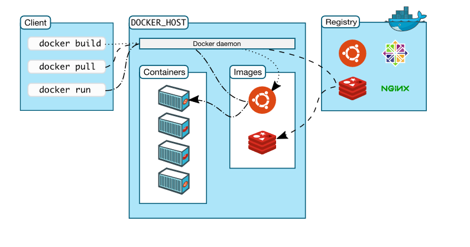

# <b>¿Qué es DOCKER?</b>

<cite style="display:block; text-align: justify">
Docker es una plataforma de software que le permite crear, probar e implementar aplicaciones rápidamente. 

Docker empaqueta software en unidades estandarizadas llamadas [contenedores][1_0] que incluyen todo lo necesario para que el software se ejecute, incluidas bibliotecas, herramientas de sistema, código y tiempo de ejecución. Con Docker, puede implementar y ajustar la escala de aplicaciones rápidamente en cualquier entorno con la certeza de saber que su código se ejecutará.
La ejecución de Docker en AWS les ofrece a desarrolladores y administradores una manera muy confiable y económica de crear, enviar y ejecutar aplicaciones distribuidas en cualquier escala.</cite>

 

[1_0]:https://aws.amazon.com/es/containers/

# ¿Cómo funciona Docker?

<cite style="display:block; text-align: justify">
Docker le proporciona una manera estándar de ejecutar su código. Docker es un sistema operativo para contenedores. De manera similar a cómo una máquina virtual virtualiza (elimina la necesidad de administrar directamente) el hardware del servidor, los contenedores virtualizan el sistema operativo de un servidor. Docker se instala en cada servidor y proporciona comandos sencillos que puede utilizar para crear, iniciar o detener contenedores.

Los servicios de AWS como [AWS Fargate][1_1], [Amazon ECS][1_2], [Amazon EKS][1_3] y [AWS Batch][1_4] hacen que resulte sencillo ejecutar y administrar contenedores de Docker a escala.</cite>

[1_1]:https://aws.amazon.com/es/fargate/
[1_2]:https://aws.amazon.com/es/ecs/
[1_3]:https://aws.amazon.com/es/eks/
[1_4]:https://aws.amazon.com/es/batch/

# ¿Por qué usar Docker?

<cite style="display:block; text-align: justify">
Docker le permite entregar código con mayor rapidez, estandarizar las operaciones de las aplicaciones, transferir el código con facilidad y ahorrar dinero al mejorar el uso de recursos. Con Docker, obtiene un solo objeto que se puede ejecutar de manera fiable en cualquier lugar. La sintaxis sencilla y simple de Docker le aporta un control absoluto. La amplia adopción significa que existe un gran ecosistema de herramientas y aplicaciones listas para su uso que puede utilizar con Docker.</cite>

 

# ¿Cuándo usar Docker?

<cite style="display:block; text-align: justify">
Puede utilizar los contenedores de Docker como bloque de construcción principal a la hora de crear aplicaciones y plataformas modernas. Docker facilita la creación y la ejecución de arquitecturas de microservicios distribuidos, la implementación de código con canalizaciones de integración y entrega continuas estandarizadas, la creación de sistemas de procesamiento de datos altamente escalables y la creación de plataformas completamente administradas para sus desarrolladores. La colaboración reciente entre AWS y Docker facilita la implementación de artefactos de Docker Compose en Amazon ECS y AWS Fargate. </cite>

 

# Traditional vs. New-Generation Virtualization

<cite style="display:block; text-align: justify">Anteriormente, solíamos crear máquinas virtuales, y cada VM tenía un sistema operativo que ocupaba mucho espacio y lo hacía pesado.

Ahora, en el caso del contenedor de la ventana acoplable, tiene un solo sistema operativo y los recursos se comparten entre los contenedores. Por lo tanto, es ligero y arranca en segundos.</cite>

# Arquitectura DOCKER

<cite style="display:block; text-align: justify">
La arquitectura Docker es una arquitectura cliente-servidor, dónde el cliente habla con el servidor (que es un proceso daemon) mediante un API para poder gestionar el ciclo de vida de los contenedores y así poder construir, ejecutar y distribuir los contenedores.

El hecho de que el cliente se comunique con el servidor mediante el API hace que el cliente y servidor puedan estar en la misma máquina comunicándose mediante sockets de UNIX o bien en máquinas diferentes comunicándose mediante un end-point en la red.</cite>

 

<cite style="display:block; text-align: justify">Dentro de los elementos de la Arquitectura Docker encontramos dos, por un lado el elemento principal de la arquitectura Docker que es el <b>Docker Engine</b> y por otro el <b>Registro Docker.</b></cite>

# Docker Engine

<cite style="display:block; text-align: justify">El Docker Engine es la aplicación cliente-servidor que implementa Docker. Esta aplicación tiene tres componentes:

* <b>Servidor:</b> Es el proceso principal de Docker y que funciona como proceso demonio del sistema. Es el encargado de gestionar los objetos que hay en Docker como imágenes, contenedores, redes y volúmenes. Se representa mediante el comando dockerd.

* <b>API Rest:</b> Es un API Rest que nos permite acceder a las capacidades del servidor y ejecutar comandos sobre él. Podemos utilizar un simple curl para acceder a las capacidades del API de Docker.

* <b>Interfaz de línea de comandos (CLI):</b> Es la línea de comandos representada por el comando docker. El cliente habla vía el API Rest para poder ejecutar los comandos. Es lo que utilizaremos para poder ir gestionando el ciclo de vida de nuestras imágenes y contenedores.</cite>

# Cliente Docker

<cite style="display:block; text-align: justify">Los usuarios de Docker pueden interactuar con Docker a través de un cliente. Cuando se ejecuta cualquier comando de docker, el cliente los envía al demonio dockerd, que los ejecuta. Los comandos de Docker utilizan la API de Docker. El cliente de Docker puede comunicarse con más de un demonio.</cite>

# Registros Docker

<cite style="display:block; text-align: justify">Además del Docker Engine la Arquitectura Docker contiene otro elemento importante que son los registros Docker.

Los registros Docker (Docker Registry) son los que almacenan imágenes Docker. El Docker Hub es un registro público que almacena múltiples imágenes, algunas de ellas certificadas por Docker.

Por defecto, cuando ejecutamos un comando para crear un contenedor, se buscan las imágenes en Docker Hub. Si bien se pueden crear registros privados de imágenes mediante Docker Datacenter (DDC) y Docker Trusted Registry (DTR).</cite>

# Objetos Docker

<cite style="display:block; text-align: justify">Cuando trabaja con Docker, usa imágenes, contenedores, volúmenes, redes; todos estos son objetos de Docker.</cite>

# Imágenes

<cite style="display:block; text-align: justify">Las imágenes de Docker son plantillas de solo lectura con instrucciones para crear un contenedor de Docker. La imagen de Docker puede extraerse de un concentrador de Docker y usarse tal como está, o puede agregar instrucciones adicionales a la imagen base y crear una imagen de Docker nueva y modificada. Puede crear sus propias imágenes de la ventana acoplable también utilizando un archivo acoplable. Cree un dockerfile con todas las instrucciones para crear un contenedor y ejecutarlo; creará su imagen de ventana acoplable personalizada.

La imagen de Docker tiene una capa base que es de solo lectura y la capa superior se puede escribir. Cuando edita un archivo docker y lo reconstruye, solo la parte modificada se reconstruye en la capa superior.</cite>

# Contenedores

<cite style="display:block; text-align: justify">Después de ejecutar una imagen de la ventana acoplable, crea un contenedor de la ventana acoplable. Todas las aplicaciones y su entorno se ejecutan dentro de este contenedor. Puede usar la API o la CLI de Docker para iniciar, detener y eliminar un contenedor de Docker.

A continuación se muestra un comando de muestra para ejecutar un contenedor docker de ubuntu:

                        docker run -i -t ubuntu /bin/bash

</cite>

# Volúmenes

<cite style="display:block; text-align: justify">Los datos persistentes generados por Docker y utilizados por los contenedores de Docker se almacenan en Volumes. Están completamente administrados por Docker a través de Docker CLI o Docker API. Los volúmenes funcionan en contenedores de Windows y Linux. En lugar de conservar los datos en la capa de escritura de un contenedor, siempre es una buena opción utilizar volúmenes para ello. El contenido del volumen existe fuera del ciclo de vida de un contenedor, por lo que usar el volumen no aumenta el tamaño de un contenedor.

Puede usar el indicador -v o –mount para iniciar un contenedor con un volumen. En este comando de muestra, está usando geekvolume volume con el contenedor geekflare.

                docker run -d --name geekflare  -v geekvolume:/app nginx:latest

</cite>

# Redes

<cite style="display:block; text-align: justify">La red Docker es un pasaje a través del cual se comunican todos los contenedores aislados. Hay principalmente cinco controladores de red en la ventana acoplable:

1. <b>Puente:</b> Es el controlador de red predeterminado para un contenedor. Utiliza esta red cuando su aplicación se ejecuta en contenedores independientes, es decir, varios contenedores que se comunican con el mismo host de la ventana acoplable.

1. <b>Anfitrión:</b> Este controlador elimina el aislamiento de red entre los contenedores de la ventana acoplable y el host de la ventana acoplable. Se utiliza cuando no necesita ningún aislamiento de red entre el host y el contenedor.

1. <b>Superposición:</b> Esta red permite que los servicios de enjambre se comuniquen entre sí. Se utiliza cuando los contenedores se ejecutan en diferentes hosts de Docker o cuando los servicios de enjambre están formados por múltiples aplicaciones.

1. <b>Ninguna:</b> Este controlador desactiva todas las redes.

1. <b>macvlan:</b> Este controlador asigna direcciones mac a los contenedores para que parezcan dispositivos físicos. El tráfico se enruta entre contenedores a través de sus direcciones mac. Esta red se utiliza cuando desea que los contenedores se vean como un dispositivo físico, por ejemplo, al migrar una configuración de VM.
</cite>

# Mas Información
* [¿Qué es Docker?][2_1]
* [Arquitectura Docker][2_2]
* [Docker Architecture y sus componentes para principiantes][2_3]

[2_1]:https://aws.amazon.com/es/docker/
[2_2]:https://www.arquitectoit.com/docker/arquitectura-docker/
[2_3]:https://geekflare.com/es/docker-architecture/

