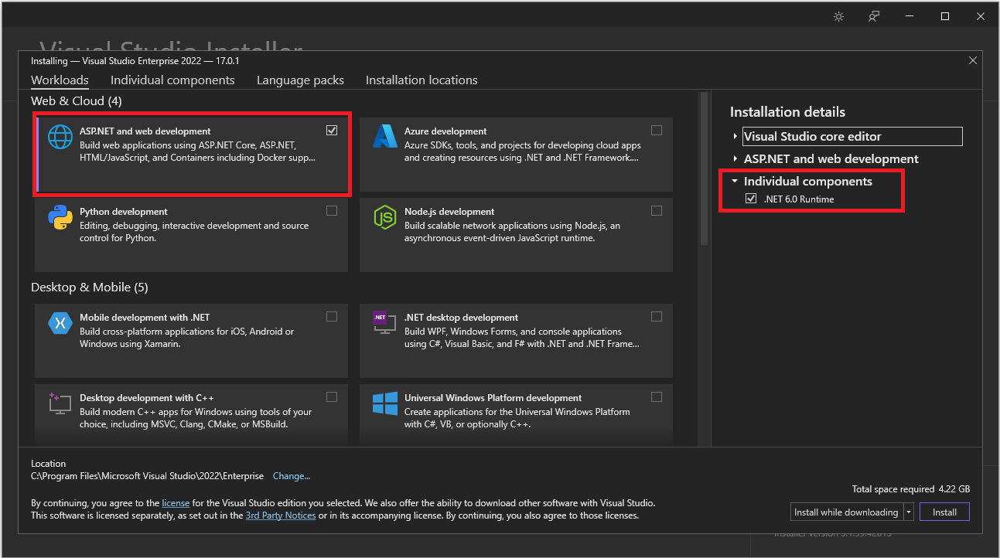
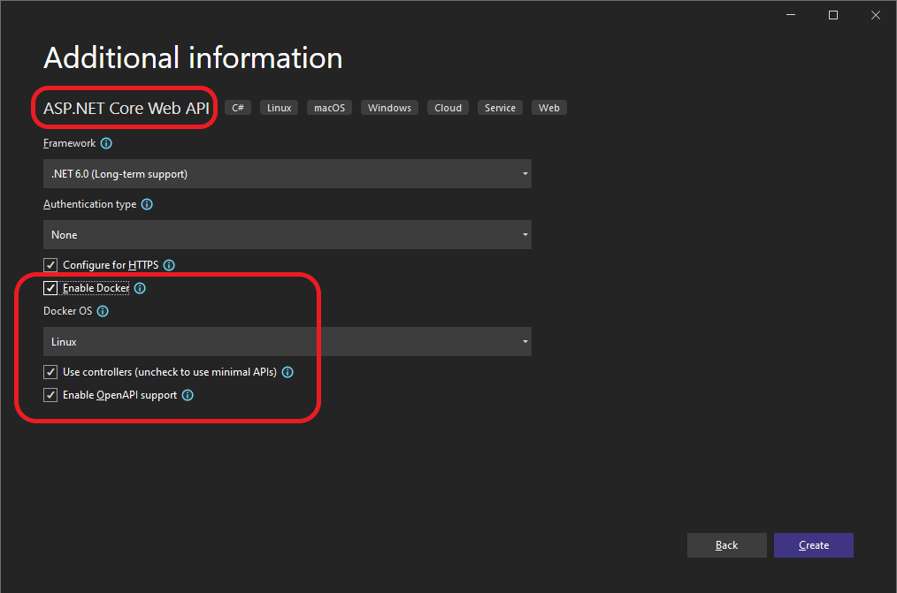
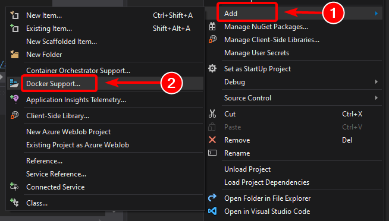

# <b>Workflow o Flujo de trabajo de desarrollo para aplicaciones de Docker</b>

<cite style="display:block; text-align: justify">El ciclo de vida de desarrollo de una aplicación se inicia en el equipo de cada desarrollador, donde se programa la aplicación con el lenguaje preferido y se prueba en el entorno local. Con este flujo de trabajo, no importa el lenguaje, el marco ni la plataforma que se elija, ya que siempre se desarrollan y se prueban contenedores de Docker en local.

Cada contenedor (una instancia de una imagen de Docker) incluye los siguientes componentes:

* Una selección de sistema operativo, por ejemplo, una distribución de Linux, Windows Nano Server o Windows Server Core.

* Archivos agregados durante el desarrollo, por ejemplo, archivos binarios de código fuente y aplicación.

* Información de configuración, como configuración de entorno y dependencias.</cite>

# <b>Flujo de trabajo para desarrollar aplicaciones basadas en contenedor de Docker</b>

<cite style="display:block; text-align: justify">En esta sección se explica el flujo de trabajo de desarrollo de bucle interno para aplicaciones basadas en contenedor de Docker. Flujo de trabajo de bucle interno significa que no se tiene en cuenta el flujo de trabajo general de DevOps, que puede incluir hasta implementación en producción, y solo se centra en el trabajo de desarrollo realizado en el equipo del desarrollador. Los pasos iniciales para configurar el entorno no se incluyen, ya que se realizan solo una vez.

Una aplicación se compone de sus propios servicios, además de bibliotecas adicionales (dependencias). Estos son los pasos básicos que normalmente se realizan al compilar una aplicación de Docker, como se muestra en la imagen.</cite>

 

<cite style="display:block; text-align: justify">En esta sección se detalla el proceso completo y se explica cada paso importante centrándose en un entorno de Visual Studio.</cite>

# <b>Paso 1. Empezar a programar y crear la aplicación inicial o la base de referencia del servicio</b>

<cite style="display:block; text-align: justify">El desarrollo de una aplicación de Docker es similar al desarrollo de una aplicación sin Docker. La diferencia es que al desarrollar para Docker, la aplicación o los servicios que se están implementando y probando se ejecutan en contenedores de Docker en el entorno local (una instalación de máquina virtual de Linux realizada por Docker o directamente Windows si se usan contenedores de Windows).</cite>

# <b>Configurar el entorno local con Visual Studio</b>

<cite style="display:block; text-align: justify">Para empezar, asegúrese de que tiene instalado <b>Docker Desktop</b> para Windows.

Además, se necesita Visual Studio 2022 versión 17.0, con la carga de trabajo Desarrollo web y .ASP NET instalada, tal como se muestra en la imagen.</cite>

 

<cite style="display:block; text-align: justify">Puede empezar a programar la aplicación en .NET sin formato (normalmente en .NET Core o versiones posteriores si va a usar contenedores) incluso antes de habilitar Docker en la aplicación, e implementar y probar en Docker. Pero se recomienda empezar a trabajar en Docker tan pronto como sea posible, ya que es el entorno real y se pueden detectar los problemas a la mayor brevedad. Se recomienda encarecidamente porque Visual Studio facilita tanto el trabajo con Docker que casi parece transparente: el mejor ejemplo al depurar aplicaciones de varios contenedores desde Visual Studio.</cite>

# <b>Paso 2. Crear un Dockerfile relacionado con una imagen base existente de .NET</b>

<cite style="display:block; text-align: justify">Necesita un Dockerfile para cada imagen personalizada que quiera compilar; también necesita un Dockerfile para cada contenedor que se vaya a implementar, tanto si se implementa automáticamente desde Visual Studio como manualmente mediante la CLI de Docker (comandos docker run y docker-compose). Si la aplicación contiene un único servicio personalizado, necesita un solo Dockerfile. Si la aplicación contiene varios servicios (como en una arquitectura de microservicios), necesita un Dockerfile para cada servicio.

El Dockerfile se coloca en la carpeta raíz de la aplicación o el servicio. Contiene los comandos que indican a Docker cómo configurar y ejecutar la aplicación o el servicio en un contenedor. Puede crear un Dockerfile de forma manual en el código y agregarlo al proyecto junto con las dependencias de .NET.

Con Visual Studio y sus herramientas para Docker, esta tarea solo exige unos clics. Al crear un proyecto en Visual Studio 2022, hay una opción denominada Habilitar compatibilidad con Docker.</cite>

<cite style="display:block; text-align: justify">También puede habilitar la compatibilidad con Docker en un proyecto de aplicación web de ASP.NET Core existente haciendo clic con el botón derecho en el proyecto, en el Explorador de soluciones, y seleccionando Agregar>Compatibilidad con Docker...</cite>

<cite style="display:block; text-align: justify">Esta acción agrega un Dockerfile al proyecto con la configuración necesaria y solo está disponible en los proyectos de ASP.NET Core.

De forma similar, Visual Studio también puede agregar un docker-compose.yml archivo para toda la solución con la opción Agregar > compatibilidad con Container Orchestrator....</cite>