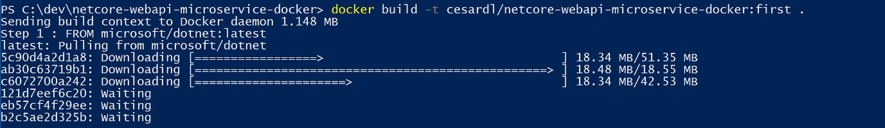

# <b>Workflow o Flujo de trabajo de desarrollo para aplicaciones de Docker</b>

<cite style="display:block; text-align: justify">El ciclo de vida de desarrollo de una aplicación se inicia en el equipo de cada desarrollador, donde se programa la aplicación con el lenguaje preferido y se prueba en el entorno local. Con este flujo de trabajo, no importa el lenguaje, el marco ni la plataforma que se elija, ya que siempre se desarrollan y se prueban contenedores de Docker en local.

Cada contenedor (una instancia de una imagen de Docker) incluye los siguientes componentes:

* Una selección de sistema operativo, por ejemplo, una distribución de Linux, Windows Nano Server o Windows Server Core.

* Archivos agregados durante el desarrollo, por ejemplo, archivos binarios de código fuente y aplicación.

* Información de configuración, como configuración de entorno y dependencias.</cite>

# <b>Flujo de trabajo para desarrollar aplicaciones basadas en contenedor de Docker</b>

<cite style="display:block; text-align: justify">En esta sección se explica el flujo de trabajo de desarrollo de bucle interno para aplicaciones basadas en contenedor de Docker. Flujo de trabajo de bucle interno significa que no se tiene en cuenta el flujo de trabajo general de DevOps, que puede incluir hasta implementación en producción, y solo se centra en el trabajo de desarrollo realizado en el equipo del desarrollador. Los pasos iniciales para configurar el entorno no se incluyen, ya que se realizan solo una vez.

Una aplicación se compone de sus propios servicios, además de bibliotecas adicionales (dependencias). Estos son los pasos básicos que normalmente se realizan al compilar una aplicación de Docker, como se muestra en la imagen.</cite>

 

<cite style="display:block; text-align: justify">En esta sección se detalla el proceso completo y se explica cada paso importante centrándose en un entorno de Visual Studio.</cite>

# <b>Paso 1. Empezar a programar y crear la aplicación inicial o la base de referencia del servicio</b>

<cite style="display:block; text-align: justify">El desarrollo de una aplicación de Docker es similar al desarrollo de una aplicación sin Docker. La diferencia es que al desarrollar para Docker, la aplicación o los servicios que se están implementando y probando se ejecutan en contenedores de Docker en el entorno local (una instalación de máquina virtual de Linux realizada por Docker o directamente Windows si se usan contenedores de Windows).</cite>

# <b>Configurar el entorno local con Visual Studio</b>

<cite style="display:block; text-align: justify">Para empezar, asegúrese de que tiene instalado <b>Docker Desktop</b> para Windows.

Además, se necesita Visual Studio 2022 versión 17.0, con la carga de trabajo Desarrollo web y .ASP NET instalada, tal como se muestra en la imagen.</cite>

 

<cite style="display:block; text-align: justify">Puede empezar a programar la aplicación en .NET sin formato (normalmente en .NET Core o versiones posteriores si va a usar contenedores) incluso antes de habilitar Docker en la aplicación, e implementar y probar en Docker. Pero se recomienda empezar a trabajar en Docker tan pronto como sea posible, ya que es el entorno real y se pueden detectar los problemas a la mayor brevedad. Se recomienda encarecidamente porque Visual Studio facilita tanto el trabajo con Docker que casi parece transparente: el mejor ejemplo al depurar aplicaciones de varios contenedores desde Visual Studio.</cite>

# <b>Paso 2. Crear un Dockerfile relacionado con una imagen base existente de .NET</b>

<cite style="display:block; text-align: justify">Necesita un Dockerfile para cada imagen personalizada que quiera compilar; también necesita un Dockerfile para cada contenedor que se vaya a implementar, tanto si se implementa automáticamente desde Visual Studio como manualmente mediante la CLI de Docker (comandos docker run y docker-compose). Si la aplicación contiene un único servicio personalizado, necesita un solo Dockerfile. Si la aplicación contiene varios servicios (como en una arquitectura de microservicios), necesita un Dockerfile para cada servicio.

El Dockerfile se coloca en la carpeta raíz de la aplicación o el servicio. Contiene los comandos que indican a Docker cómo configurar y ejecutar la aplicación o el servicio en un contenedor. Puede crear un Dockerfile de forma manual en el código y agregarlo al proyecto junto con las dependencias de .NET.

Con Visual Studio y sus herramientas para Docker, esta tarea solo exige unos clics. Al crear un proyecto en Visual Studio 2022, hay una opción denominada Habilitar compatibilidad con Docker.</cite>

<cite style="display:block; text-align: justify">También puede habilitar la compatibilidad con Docker en un proyecto de aplicación web de ASP.NET Core existente haciendo clic con el botón derecho en el proyecto, en el Explorador de soluciones, y seleccionando Agregar>Compatibilidad con Docker...</cite>

<cite style="display:block; text-align: justify">Esta acción agrega un Dockerfile al proyecto con la configuración necesaria y solo está disponible en los proyectos de ASP.NET Core.

De forma similar, Visual Studio también puede agregar un docker-compose.yml archivo para toda la solución con la opción Agregar > compatibilidad con Container Orchestrator....</cite>

# <b>Uso de una imagen de Docker de .NET oficial existente</b>

<cite style="display:block; text-align: justify">Normalmente se compila una imagen personalizada para el contenedor además de una imagen base que se obtiene de un repositorio oficial como el registro Docker Hub. Eso es precisamente lo que sucede en segundo plano cuando se habilita la compatibilidad con Docker en Visual Studio. El Dockerfile usa una imagen <b>dotnet/core/aspnet</b> existente.

Anteriormente se ha explicado qué imágenes y repositorios de Docker se pueden usar según el marco de trabajo y el sistema operativo elegidos. Por ejemplo, si quiere usar ASP.NET Core (Linux o Windows), la imagen que se debe usar es <b>mcr.microsoft.com/dotnet/aspnet:6.0.</b> Por lo tanto, debe especificar qué imagen base de Docker va a usar para el contenedor. Se hace mediante la incorporación de <b>FROM mcr.microsoft.com/dotnet/aspnet:6.0</b> al Dockerfile. Visual Studio lo hace de forma automática, pero si va a actualizar la versión, actualice este valor.

El uso de un repositorio de imágenes de .NET oficial de Docker Hub con un número de versión garantiza que haya las mismas características de lenguaje disponibles en todos los equipos (incluido el desarrollo, las pruebas y la producción).

En el ejemplo siguiente se muestra un Dockerfile de ejemplo para un contenedor de ASP.NET Core.

                    FROM mcr.microsoft.com/dotnet/aspnet:6.0
                    ARG source
                    WORKDIR /app
                    EXPOSE 80
                    COPY ${source:-obj/Docker/publish} .
                    ENTRYPOINT ["dotnet", " MySingleContainerWebApp.dll "]

En este caso, la imagen se basa en la versión 6.0 de la imagen de Docker oficial de ASP.NET Core (arquitectura múltiple para Linux y Windows). Es el valor <b>FROM mcr.microsoft.com/dotnet/aspnet:6.0.</b> También debe indicar a Docker que escuche en el puerto TCP que se vaya a usar en tiempo de ejecución (en este caso, el puerto 80, como se ha configurado con el valor EXPOSE).

Puede especificar otros valores de configuración en el Dockerfile, según el lenguaje y el marco que use. Por ejemplo, la línea <b>ENTRYPOINT con ["dotnet", "MySingleContainerWebApp.dll"]</b> indica a Docker que ejecute una aplicación .NET. Si usa el SDK y la CLI de .NET (dotnet CLI) para compilar y ejecutar la aplicación .NET, este valor sería diferente. La conclusión es que la línea ENTRYPOINT y otros valores pueden variar según el lenguaje y la plataforma que se elijan para la aplicación.</cite>

# <b>Uso de repositorios de imágenes multiarquitectura</b>

<cite style="display:block; text-align: justify">Un solo repositorio puede contener variantes de plataforma, como una imagen de Linux y una imagen de Windows. Esta característica permite a los proveedores como Microsoft (creadores de imágenes base) crear un único repositorio que cubra varias plataformas (es decir, Linux y Windows). Por ejemplo, el repositorio .NET disponible en el registro de Docker Hub proporciona compatibilidad con Linux y Windows Nano Server mediante el mismo nombre de repositorio.

Si especifica una etiqueta, se toma como destino una plataforma explícita, como en los casos siguientes:

* <b>mcr.microsoft.com/dotnet/aspnet:6.0-bullseye-slim
 Destinos:</b> solo entorno de ejecución de .NET 6 en Linux

* <b>mcr.microsoft.com/dotnet/aspnet:6.0-nanoserver-ltsc2022
Destinos:</b> solo entorno de ejecución de .NET 6 en Windows Nano Server

Pero, si se especifica el mismo nombre de imagen, incluso con la misma etiqueta, las imágenes multiarquitectura (como la imagen aspnet) usan la versión de Linux o Windows según el sistema operativo del host de Docker que se vaya a implementar, como se muestra en el ejemplo siguiente:

* <b>mcr.microsoft.com/dotnet/aspnet:6.0
Arquitectura múltiple:</b> solo entorno de ejecución de .NET 6 en Linux o Windows Nano Server según el sistema operativo del host de Docker.

De esta forma, al extraer una imagen de un host de Windows, se extrae la variante de Windows, y al extraer el mismo nombre de imagen de un host de Linux, se extrae la variante de Linux.</cite>

# <b>Compilaciones de varias fases en Dockerfile</b>

<cite style="display:block; text-align: justify">El Dockerfile es similar a un script por lotes. Es similar a lo que haría si tuviera que configurar el equipo desde la línea de comandos.

Comienza con una imagen base que configura el contexto inicial, es como el sistema de archivos de inicio, que se coloca sobre el sistema operativo del host. No es un sistema operativo, pero se puede considerar como "el" sistema operativo dentro del contenedor.

La ejecución de cada línea de comandos crea una nueva capa en el sistema de archivos con los cambios de la anterior, por lo que, cuando se combinan, generan el sistema de archivos resultante.

Dado que cada nueva capa "descansa" sobre la anterior y el tamaño de la imagen resultante aumenta con cada comando, las imágenes pueden llegar a tener un gran tamaño si tienen que incluir, por ejemplo, el SDK necesario para compilar y publicar una aplicación.

Aquí es donde las compilaciones de varias fases entran en escena (a partir de Docker 17.05 y posterior) para hacer su magia.

La idea central es que puede separar el proceso de ejecución del Dockerfile en fases, donde una fase es una imagen inicial seguida de uno o más comandos, y la última fase determina el tamaño final de la imagen.

En resumen, las compilaciones de varias fases permiten dividir la creación en "fases" distintas y, luego, ensamblar la imagen final al tomar solo los directorios pertinentes de las fases intermedias. La estrategia general para usar esta característica es:

1. Usar una imagen base de SDK (no importa su tamaño), con todo lo necesario para compilar y publicar la aplicación en una carpeta

1. Usar una imagen base pequeña de solo el entorno de ejecución y copiar la carpeta de publicación de la fase anterior para generar una pequeña imagen final.

Probablemente la mejor manera de comprender las fases es analizar un archivo Dockerfile en detalle, línea a línea, así que vamos a comenzar con el Dockerfile inicial creado por Visual Studio al agregar compatibilidad con Docker a un proyecto y, luego, realizaremos algunas optimizaciones.

El Dockerfile inicial podría ser algo parecido a esto:</cite>

<cite style="display:block; text-align: justify">Y estos son los detalles, línea a línea:

* <b>Línea 1:</b> Comience una fase con una imagen base "pequeña" de solo el entorno de ejecución, denomínela base para referencia.

* <b>Línea 2:</b> Cree el directorio /app de la imagen.

* <b>Línea 3:</b> Exponga el puerto 80.

* <b>Línea 5:</b> Comience una nueva fase con una imagen "grande" para compilar y publicar. Denomínela build como referencia.

* <b>Línea 6:</b> Cree un directorio /src en la imagen.

* <b>Línea 7:</b> Hasta la línea 16, copie los archivos del proyecto .csproj a los que se hace referencia para poder restaurar los paquetes más adelante.

* <b>Línea 17:</b> Restaure los paquetes del proyecto Catalog.API y los proyectos a los que se hace referencia.

* <b>Línea 18:</b> Copie todo el árbol de directorio de la solución (excepto los archivos o directorios incluidos en el archivo .dockerignore) en el directorio /src de la imagen.

* <b>Línea 19:</b> Cambie la carpeta actual al proyecto Catalog.API.

* <b>Línea 20:</b> Compile el proyecto (y otras dependencias del proyecto) y use como salida el directorio /app de la imagen.

* <b>Línea 22:</b> Comience una nueva fase a partir de la compilación. Denomínela publish como referencia.

* <b>Línea 23:</b> Publique el proyecto (y las dependencias) y use como salida el directorio /app de la imagen.

* <b>Línea 25:</b> Comience una nueva fase a partir de base y denomínela final.

* <b>Línea 26:</b> Cambie el directorio actual a /app.

* <b>Línea 27:</b> Copie el directorio /app de la fase publish en el directorio actual.

* <b>Línea 28:</b> Defina el comando que se va a ejecutar cuando se inicie el contenedor.</cite>

# <b>Paso 3. Crear las imágenes de Docker personalizadas e insertar la aplicación o el servicio en ellas</b>

<cite style="display:block; text-align: justify">Debe crear una imagen relacionada para cada servicio de la aplicación. Si la aplicación está formada por un único servicio o aplicación web, solo necesita una imagen.

Tenga en cuenta que las imágenes de Docker se compilan automáticamente en Visual Studio. Los pasos siguientes solo son necesarios para el flujo de trabajo de editor/CLI y se explican para aclarar lo que sucede en segundo plano.

Como desarrollador, debe desarrollar y probar en local hasta que inserte una característica o cambio completados en el sistema de control de código fuente (por ejemplo, en GitHub). Esto significa que tiene que crear las imágenes de Docker e implementar contenedores en un host de Docker local (máquina virtual de Windows o Linux) y ejecutar, probar y depurar en esos contenedores locales.

Para crear una imagen personalizada en el entorno local mediante la CLI de Docker y el Dockerfile, puede usar el comando docker build.</cite>

<cite style="display:block; text-align: justify">De forma opcional, en lugar de ejecutar directamente docker build desde la carpeta del proyecto, primero puede generar una carpeta que se pueda implementar con las bibliotecas de .NET y los binarios necesarios mediante la ejecución de dotnet publish y, luego, usar el comando docker build.

Esto crea una imagen de Docker con el nombre cesardl/netcore-webapi-microservice-docker:first. En este caso, :first es una etiqueta que representa una versión específica. Puede repetir este paso para cada imagen personalizada que tenga que crear para la aplicación de Docker compuesta.

Cuando una aplicación se compone de varios contenedores (es decir, es una aplicación de varios contenedores), también puede usar el comando docker-compose up --build para compilar todas las imágenes relacionadas con un solo comando al usar los metadatos expuestos en los archivos relacionados docker-compose.yml.

Puede encontrar las imágenes existentes en el repositorio local mediante el comando docker images, como se muestra en la imagen.</cite>

# <b>Paso 4. Definir los servicios en docker-compose.yml al compilar una aplicación de Docker de varios contenedores</b>

<cite style="display:block; text-align: justify">El archivo [docker-compose.yml][1_0] permite definir un conjunto de servicios relacionados para implementarlos como una aplicación compuesta con comandos de implementación. También configura sus relaciones de dependencia y la configuración de ejecución.

Para usar un archivo docker-compose.yml, debe crear el archivo en la carpeta de solución principal o raíz, con contenido similar al del ejemplo siguiente:</cite>

[1_0]:https://docs.docker.com/compose/compose-file/

<cite style="display:block; text-align: justify">Este archivo docker-compose.yml es una versión simplificada y combinada. Contiene datos de configuración estáticos para cada contenedor (como el nombre de la imagen personalizada), que siempre son necesarios, junto con información de configuración que puede depender del entorno de implementación, como la cadena de conexión. En secciones posteriores se enseña a dividir la configuración de docker-compose.yml en varios archivos docker-compose y a reemplazar los valores según el entorno y el tipo de ejecución (depuración o versión).

El ejemplo de archivo docker-compose.yml define cuatro servicios: el servicio webmvc (una aplicación web), dos microservicios (ordering-api y basket-api) y un contenedor de fuente de datos, sqldata, según el servidor de SQL Server para Linux que se ejecute como contenedor. Cada servicio se implementa como un contenedor, por lo que se necesita una imagen de Docker para cada uno de ellos.

El archivo docker-compose.yml especifica no solo qué contenedores se van a usar, sino cómo se configuran individualmente. Por ejemplo, la definición del contenedor webmvc en el archivo .yml:

* Usa una imagen eshop/web:latest precompilada. Pero también puede configurar la imagen de modo que se compile como parte de la ejecución de docker-compose con una configuración adicional basada en una compilación: sección del archivo docker-compose.

* Inicializa dos variables de entorno (CatalogUrl y OrderingUrl).

* Reenvía el puerto 80 expuesto en el contenedor al puerto 80 externo del equipo de host.

* Vincula la aplicación web al catálogo y el servicio de orden con el valor depends_on. Esto hace que el servicio espere hasta que se inician los servicios.</cite>

# <b>Paso 5. Compilar y ejecutar la aplicación</b>

<cite style="display:block; text-align: justify">Si la aplicación solo tiene un contenedor, puede ejecutarla mediante su implementación en el host de Docker (máquina virtual o servidor físico). Sin embargo, si la aplicación contiene varios servicios, se puede implementar como aplicación compuesta, ya sea mediante un solo comando de la CLI docker-compose up) o con Visual Studio, que usará ese comando en segundo plano.</cite>

# <b>Opción A: Ejecución de una aplicación de un solo contenedor
# Uso de la CLI de Docker</b>

<cite style="display:block; text-align: justify">Puede ejecutar un contenedor de Docker mediante el comando docker run.

        docker run -t -d -p 80:5000 cesardl/netcore-webapi-microservice-docker:first

El comando anterior crea una nueva instancia de contenedor a partir de la imagen especificada cada vez que se ejecuta. Puede usar el parámetro --name para asignar un nombre al contenedor y, luego, usar docker start {name} (o el identificador del contenedor o el nombre automático) para ejecutar una instancia de contenedor existente.</cite>

# <b>Opción B: Ejecución de una aplicación de varios contenedores</b>

<cite style="display:block; text-align: justify">En la mayoría de los escenarios de empresa, una aplicación de Docker se compone de varios servicios, lo que significa que hay que ejecutar una aplicación de varios contenedores</cite>

# <b>Paso 6. Probar la aplicación de Docker con el host local de Docker</b>

<cite style="display:block; text-align: justify">Este paso varía en función de lo que haga la aplicación. En una aplicación web de .NET sencilla implementada como un único contenedor o servicio, puede acceder al servicio si abre un explorador en el host de Docker y va a ese sitio, como se muestra en la imagen (Si la configuración del Dockerfile asigna el contenedor a un puerto del host distinto al 80, incluya el puerto del host en la dirección URL).</cite>

# <b>Flujo de trabajo simplificado al desarrollar contenedores con Visual Studio</b>

<cite style="display:block; text-align: justify">En la práctica, el flujo de trabajo cuando se usa Visual Studio es mucho más sencillo que si se usa el enfoque de editor/CLI. La mayoría de los pasos que necesita Docker relacionados con el Dockerfile y los archivos docker-compose.yml están ocultos o se han simplificado con Visual Studio.</cite>

<cite style="display:block; text-align: justify">Además, debe realizar el paso 2 (agregar compatibilidad con Docker a los proyectos) una sola vez. Por lo tanto, el flujo de trabajo es similar a las tareas de desarrollo habituales cuando se usa .NET para cualquier otro desarrollo. Debe saber qué está sucediendo en segundo plano (el proceso de compilación de imágenes, qué imágenes base usa, la implementación de contenedores, etc.) y, a veces, también debe editar el Dockerfile o el archivo docker-compose.yml para personalizar comportamientos. Pero con Visual Studio se simplifica enormemente la mayor parte del trabajo, lo que mejora mucho la productividad.</cite>

# <b>Uso de comandos de PowerShell en un Dockerfile para configurar contenedores de Windows</b>

<cite style="display:block; text-align: justify">Los contenedores de Windows permiten convertir las aplicaciones de Windows existentes en imágenes de Docker e implementarlas con las mismas herramientas que el resto del ecosistema de Docker. Para usar contenedores de Windows, ejecute comandos de PowerShell en el Dockerfile, como se muestra en el ejemplo siguiente:</cite>

<cite style="display:block; text-align: justify">En este caso se usa una imagen base de Windows Server Core (el valor FROM) y se instala IIS con un comando de PowerShell (el valor RUN). Del mismo modo, también se pueden usar comandos de PowerShell para configurar otros componentes como ASP.NET 4.x, .NET Framework 4.6 o cualquier otro software de Windows. Por ejemplo, el siguiente comando en un Dockerfile configura ASP.NET 4.5

                    RUN powershell add-windowsfeature web-asp-net45

</cite>

# Mas Información
* [Flujo de trabajo de desarrollo para aplicaciones de Docker][2_1]

[2_1]:https://docs.microsoft.com/es-es/dotnet/architecture/microservices/docker-application-development-process/docker-app-development-workflow

