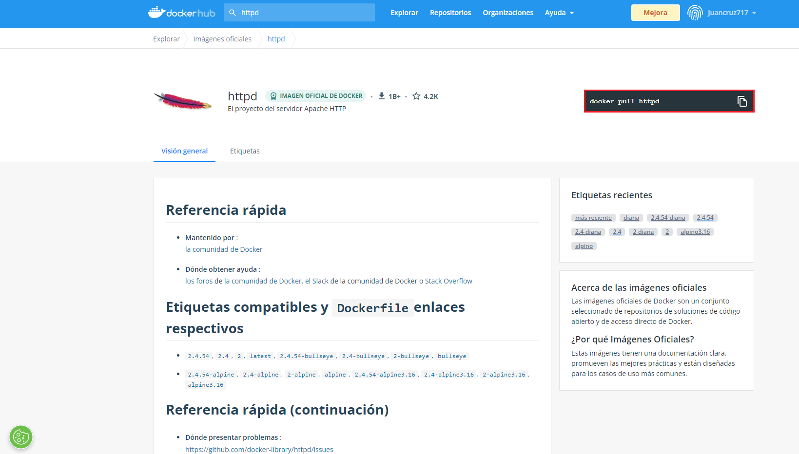
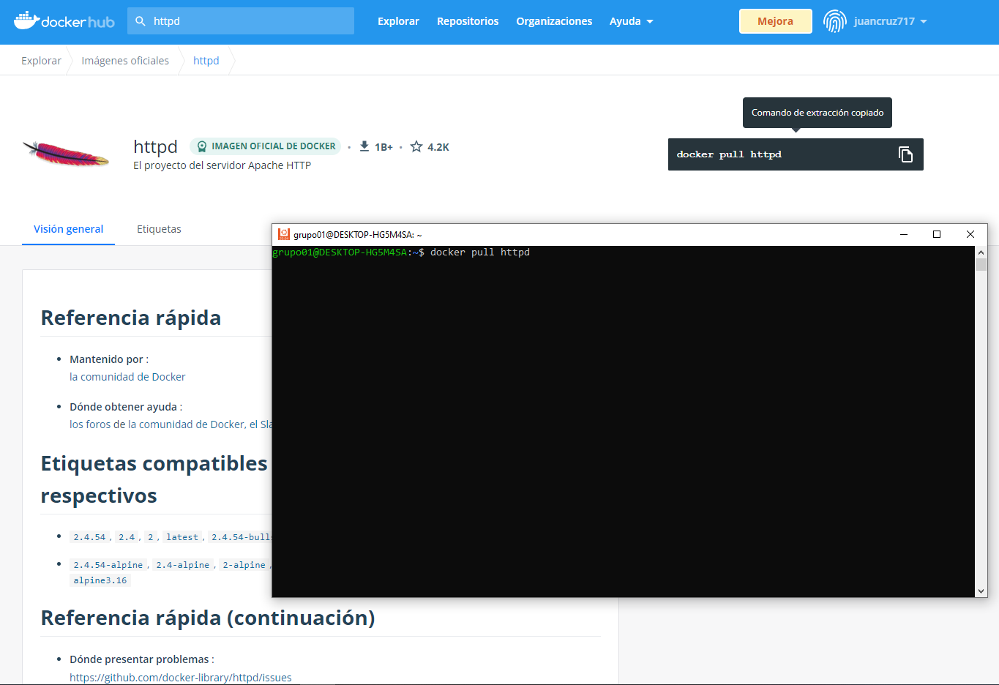
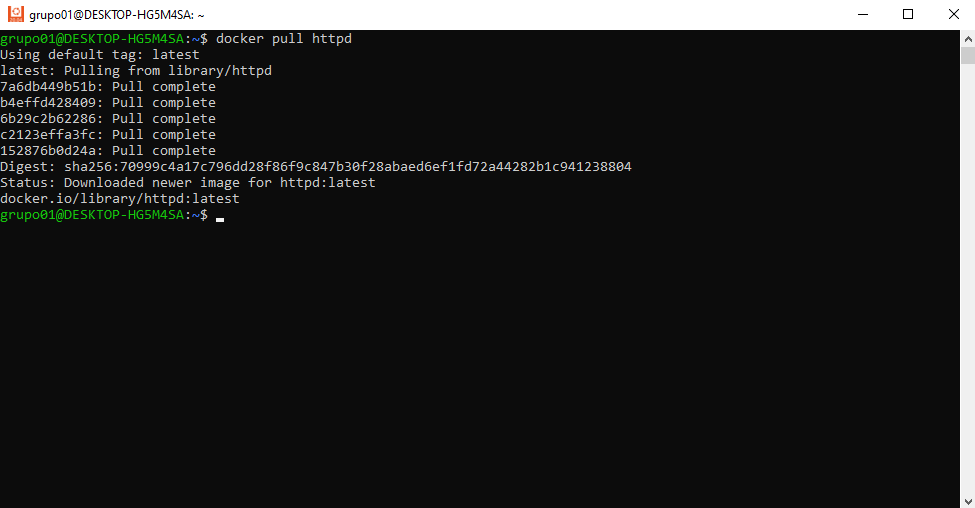
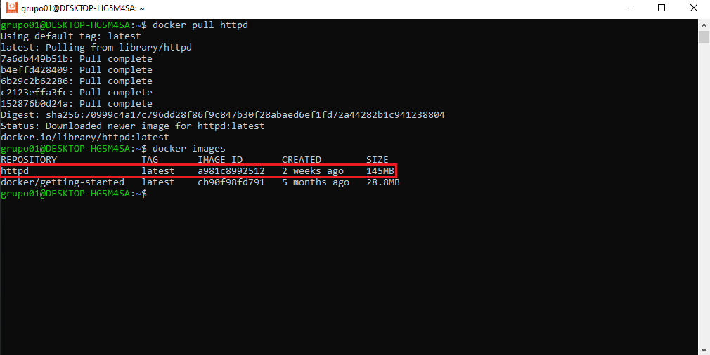
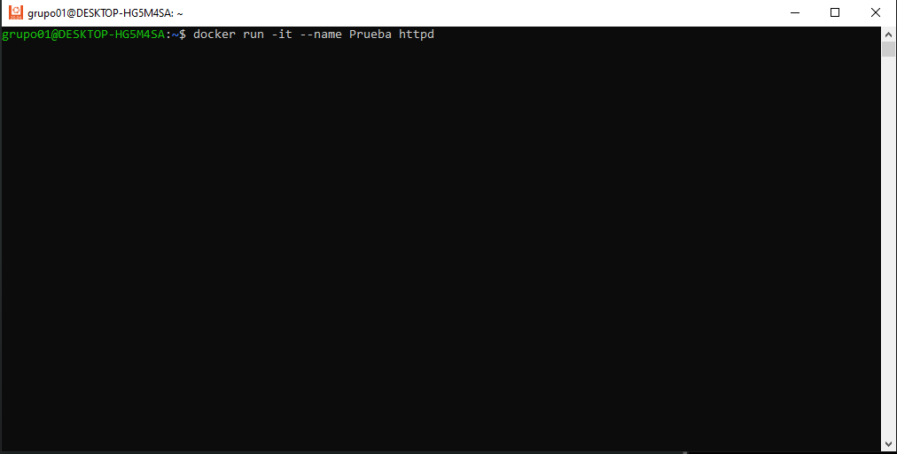
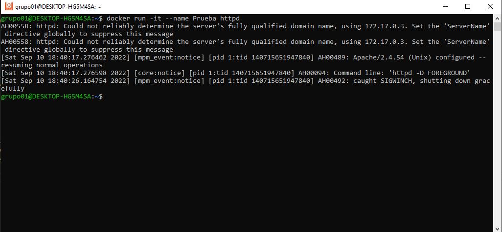
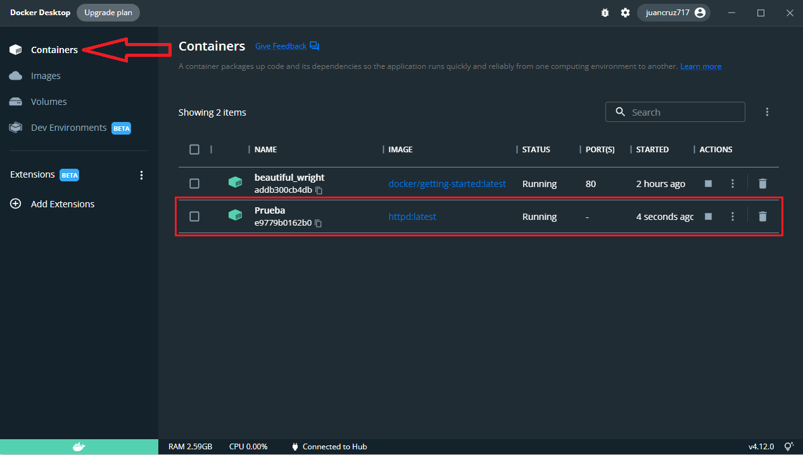

# <text style = "display:block; text-align: center"> <b>Instalar Docker en Windows 10</b>

<b><u>Requisitos minimos</u></b>

<cite style="display:block; text-align: justify">

* Windows 10 64-bit: Pro, Enterprise, or Education (Build 16299 o superior).
* Procesador de 64 bits.
* 4 GB RAM.
* Habilitar en la BIOS la característica (el nombre varia en función del procesador que tenga tu equipo) “Intel VR” o “VR-x” o “Virtualization Technology” o «AMD-V».</cite>

# <b>Instalar Docker </b>

<cite style="display:block; text-align: justify">No existe una versión de docker que funcione de forma nativa en Windows 10 sino que lo que realmente vamos a hacer es crear una máquina virtual en Hyper-V con docker embebido la cual nos permitirá ejecutar comandos de forma transparente desde la consola de Powershell o MS-DOS como si realmente la aplicación se ejecutara de forma nativa.

Lo primero que haremos sera activar la característica Hyper-V en nuestro Windows.

Escribimos Caracteristicas de Windows.</cite>

<cite style="display:block; text-align: justify"> Buscamos y marcamos la opción Hyper-V, pulsamos en Aceptar para realizar la instalación de la característica.</cite>

<cite style="display:block; text-align: justify"> Una vez finalizada la instalación, reiniciamos nuestro equipo para que se guarden y se apliquen los cambios realizados. </cite>

<cite style="display:block; text-align: justify"> Una vez activado Hyper-V y reiniciado el equipo el siguiente paso será descargar el instalador de Docker Desktop, para eso nos dirigimos a la pagina de [Docker Docs][1_0], la cual nos proporcionara un enlace directo para descargar [Docker Desktop en Windows][1_1].</cite>

[1_0]:https://docs.docker.com/desktop/install/windows-install/

[1_1]:https://desktop.docker.com/win/main/amd64/Docker%20Desktop%20Installer.exe

<cite style="display:block; text-align: justify"> Una vez descargado el instalador, lo ejecutamos.</cite>

<cite style="display:block; text-align: justify"> Lo dejamos como esta y le damos en "OK"</cite>

<cite style="display:block; text-align: justify"> Comenzara con la descarga e instalación de los paquetes necesarios.</cite>

<cite style="display:block; text-align: justify"> Pulsamos en Close and restart para reiniciar el ordenador y finalizar la instalación.</cite>

<cite style="display:block; text-align: justify"> Una vez reiniciado el equipo veremos un nuevo icono en nuestro escritorio llamado Docker Desktop, hacemos doble clic en él para iniciar docker.</cite>

<cite style="display:block; text-align: justify"> Nos aparecera esta ventana, le daremos en aceptar y se comenzara a ejecutar Docker.</cite>

<cite style="display:block; text-align: justify"> Nos aparecerá un tutorial que podremos seguir (son 2 minutos) o bien pasarlo si ya sabemos algo de docker.</cite>

<cite style="display:block; text-align: justify"> Una vez terminado el tutorial u omitirlo, nos aparecera esta ventana.

Abriremos nuestra consola de Ubuntu y pararemos a copiar y pegar el comando que nos aparece para intentar correr un contenerdor y asi comprovar que la instalación se realizo de manera exitosa.  </cite>

<cite style="display:block; text-align: justify"> Una vez ejecutamos el comando lo primero que nos aparecera sera que la imagen no se encuentra instalada de manera local.

Y luego de eso pasara a descargarla.</cite>

<cite style="display:block; text-align: justify"> Ya instalada la imagen podemos ver que en nuestro Docker ya esta instalada la imagen.</cite>

<cite style="display:block; text-align: justify"> Ya tenemos nuestro Docker funcionando y listo para trabajar.</cite>

__________________________________________________________________________________
# <text style = "display:block; text-align: center"><b>Instalar Imagen de contenedor en la librería Docker Hub</b>

<cite style="display:block; text-align: justify"> Para poder acceder a las imagenes de contenedores de Docker lo primero que debemos hacer sera crearnos una cuenta en [Docker Hub][1_2] (Enlace directo).</cite>

[1_2]:https://hub.docker.com/

<cite style="display:block; text-align: justify"> Una vez creada la cuenta nos pedira que elijamos un plan para comenzar a trabajar con Docker, en nuestro caso elijiremos el plan "Personal".</cite>

<cite style="display:block; text-align: justify"> Con esto ya podemos buscar la imagen con la cual queremos trabajar.</cite>

<cite style="display:block; text-align: justify"> Ahora nos dirigimos a la parte superior donde esta una lupa para buscar la imagen que queramos instalar.</cite>

<cite style="display:block; text-align: justify"> En este caso vamos a instalar la imagen de httpd, damos click en ella y ahora para instalarla debemos iniciar nuestro terminal de Ubuntu, copiamos el codigo que tenemos arriba a la derecha en nuestra terminal de Ubuntu.</cite>

<cite style="display:block; text-align: justify"> Una ves instalada nuestra imagen, verificamos con el comando "docker images" el cual nos va a mostrar las imagenes que tenemos instaladas en nuestro Docker y entre ellas debe estar la que acabamos de instalar que seria la de httpd.</cite>

<cite style="display:block; text-align: justify"> Ahora vamos hacer una prueba de funcionalidad de nuestro contenedor docker con la imagen que instalamos anteriormente, para esto nos vamos nuevamente a nuestra terminal de Ubuntu y digitamos el comando "docker run -it --name" con el nombre "Prueba" seguido del nombre de nuestra imagen instalada "httpd", la cual quedaria así "docker run -it --name Prueba httpd</cite>

<cite style="display:block; text-align: justify"> No dirigimos a nuestra App de Docker Desktop y vamos a Donde dice "Containers" en el cual veremos que se ah creado un nuevo contenedor con el nombre de "Prueba" que le pusimos en el terminal de Ubuntu y que esta utilizando la imagen "httpd". Con esto comprobamos que esta funcionando nuestra imagen.</cite>

# Mas Información
* [Instalar Docker en Windows 10][2_1]
* [Docker oficial][2_2]
* [Docker Hubl][2_3]

[2_1]:https://tutorialesit.com/instalar-docker-en-windows-10/
[2_2]:https://www.docker.com/
[2_3]:https://hub.docker.com/
