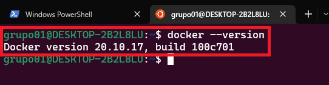
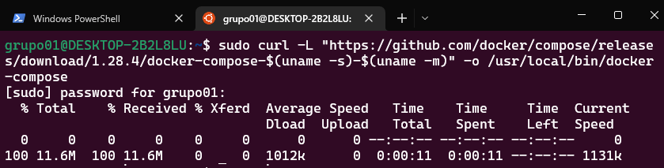
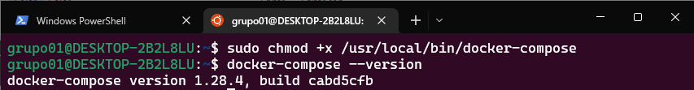

# <b>¿QUÉ ES DOCKER COMPOSE?</b>

<cite style="display:block; text-align: justify">Docker Compose es una herramienta que nos permitirá definir y ejecutar aplicaciones Docker empleando varios contenedores.
Con Compose haremos uso de un fichero de texto con la extensión YAML en el que realizaremos la configuración de los servicios (imágenes), redes y volúmenes para persistencia de datos que requieran nuestras aplicaciones.</cite>

# <b>¿Qué es un fichero con extensión YAML?</b>

<cite style="display:block; text-align: justify">YAML es un acrónimo que significa Ain’t Markup Languaje (YAML no es un leguaje de marcas). Se trata de un estándar de serialización de datos amigable para todos los lenguajes de programación. </cite>

# <b>¿En qué momento podemos hacer uso de Docker Compose?</b>

<cite style="display:block; text-align: justify">

* En entornos que se encuentren en Producción
* En entornos que se encuentren en Desarrollo
* En entornos que se encuentren en Fase de pruebas
* En flujos de CI (Integración Contínua)

Además todo esto empleando un único y simple comando

                            docker-compose up

</cite>

# <b>¿Cómo instalar Docker Compose en Ubuntu?</b>

<cite style="display:block; text-align: justify">Toda la información que necesitamos se encuentra en la documentación oficial [docs.docker.com – Install Docker Compose][1_0]

Debemos tener en cuenta que antes de realizar la instalación de Docker Compose, deberemos previamente tener instalado Docker Engine en el equipo en el que pretendamos trabajar, para comprobarlo abriremos nuestra terminal de Ubuntu y escribiremos el siguente comando.

                        docker --version
</cite>

<cite style="display:block; text-align: justify">Para realizar la instalación de Docker Compose, lo primero que haremos sera ejecutar el siguiente comando, el cual nos descargará la última versión estable de Docker Compose.

        sudo curl -L "https://github.com/docker/compose/releases/download/1.28.4/docker-compose-$(uname -s)-$(uname -m)" -o /usr/local/bin/docker-compose

</cite>

<cite style="display:block; text-align: justify">Una vez descargada, debemos asignarle permisos de ejecución al directorio /usr/local/bin/docker-compose, con el siguiente comando.

                sudo chmod +x /usr/local/bin/docker-compose

Ya tendríamos nuestro Docker Compose instalado y podemos comprobarlo así:

                docker-compose --version

</cite>

<cite style="display:block; text-align: justify">Ya nos podemos poner a trabajar con Docker Compose, pero deberemos tener en cuenta un aspecto muy importante a la hora de elaborar nuestros ficheros .yml. En ellos deberemos especificar una versión de nuestro fichero Compose, que sea compatible con la versión de Docker que tenemos instalada. </cite>

[1_0]:https://docs.docker.com/compose/install/

# Mas Información
* [Docker Compose][2_1]
* [ESTRUCTURA DE CONFIGURACIÓN DE UN ARCHIVO DOCKER COMPOSE][2_2]

[2_1]:https://iescelia.org/ciberseguridad/serie-docker-que-es-docker-compose/

[2_2]:https://iescelia.org/ciberseguridad/serie-docker-estructura-de-configuracion-de-un-archivo-docker-compose/

